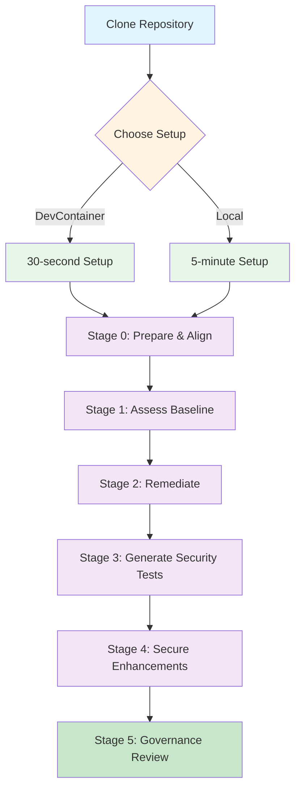

# GitHub Copilot Governance Lab - Angular

This repository contains an Angular project with intentionally vulnerable features for practicing GitHub Copilot governance end to end.

**Prerequisites:**
- Node.js 18+
- Angular CLI 16+
- IDE with GitHub Copilot extension
- Git

```bash
# Clone the repository
git clone <repository-url>
cd copilot-governance-lab-angular

# Run setup script
./scripts/setup-lab.sh

# Or manual setup
npm install
npm install -g @angular/cli@16
```

## Quick Commands
```bash
# Development
npm start                 # Start dev server (http://localhost:4200)
npm test                  # Run tests
npm run test:coverage     # Run tests with coverage

# Quality Checks
npm run lint              # Run ESLint
npm run lint:security     # Run security ESLint
npm audit                 # Check vulnerabilities
```

## Lab Architecture



## Governed Workflow Stages

1. **Stage 0 – Prepare & Align**  
   Review `.github/copilot-instructions.md`, `SECURITY.md`, `README.md`, and `QUICK_START.md`. Capture initial assumptions in `docs/workflow-tracker.md`.
2. **Stage 1 – Baseline Assessment**  
   Audit the intentionally vulnerable components under `src/app/services/` and `src/app/components/` (see `docs/vulnerability-guide.md`) and record risks with OWASP mappings, saving your assessment to `docs/plans/stage1-plan.md`.
3. **Stage 2 – Remediation with Copilot**  
   Use Copilot-driven refactors directly in those component/service files (dropping the `.vulnerable` suffix once secure) while following `docs/vulnerability-guide.md` and the tasks captured in `docs/plans/stage2-plan.md`.
4. **Stage 3 – Security Test Generation**  
   Produce comprehensive Jasmine/Karma coverage using the playbook in `docs/testing-guide.md` and the plan you capture in `docs/plans/stage3-plan.md`.
5. **Stage 4 – Secure Feature Implementation**  
   Implement proactive security features following `docs/secure-features-guide.md` and `docs/plans/stage4-plan.md`.
6. **Stage 5 – Governance Review & Reporting**  
   Execute quality gates, generate `governance-report.md`, and finalize documentation.

See `docs/workflow-guide.md` for detailed tasks per stage.

## Running Analysis Tools

```bash
# ESLint
npm run lint

# Security-focused ESLint
npm run lint:security

# Check for vulnerabilities
npm audit

# Run tests with coverage
npm run test:coverage

# Analyze bundle size
npm run build -- --stats-json
npm run analyze
```

## Project Structure
```
├── src/app/
│   ├── core/           # Core services, guards, interceptors
│   ├── features/       # Feature modules
│   └── shared/         # Shared components, models
├── docs/                   # Governance plans, trackers, coverage logs, guides
├── evaluation/         # Golden evaluation sets
├── static-analysis/    # Analysis tool configs
└── .github/           # GitHub-specific files
```

## Security Checklist
- [ ] No sensitive data in localStorage
- [ ] All inputs sanitized
- [ ] JWT stored securely
- [ ] Route guards implemented
- [ ] XSS prevention active
- [ ] CSRF protection enabled
- [ ] No innerHTML with user content
- [ ] Proper error handling
- [ ] Memory leaks prevented

## Success Metrics
Track these metrics as you implement governance:
- Vulnerabilities detected: ___
- Test coverage achieved: ___%
- Bundle size: ___KB
- ESLint warnings: ___
- Accessibility score: ___

## Common Issues & Solutions

| Issue | Solution |
|-------|----------|
| Copilot not following instructions | Ensure `.github/copilot-instructions.md` is committed |
| XSS vulnerabilities | Use DomSanitizer, avoid innerHTML |
| Memory leaks | Unsubscribe from observables |
| Large bundle size | Implement lazy loading |

## Additional Resources
- [Angular Security Guide](https://angular.io/guide/security)
- [OWASP Angular Cheat Sheet](https://cheatsheetseries.owasp.org/cheatsheets/Angular_Security_Cheat_Sheet.html)
- [RxJS Best Practices](https://angular.io/guide/rx-library)
- [GitHub Copilot Documentation](https://docs.github.com/copilot)
