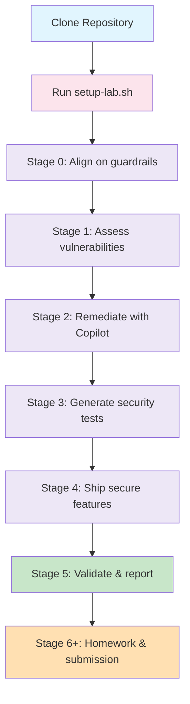

# GitHub Copilot Governance Lab – Spring Boot

This repository contains a Spring Boot 3 project seeded with governance gaps so you can practice directing GitHub Copilot, documenting decisions, and delivering secure fixes end to end. Every stage of the lab focuses on pairing AI-assisted development with auditable evidence: plans, test results, reports, and code reviews.

## Prerequisites
- JDK 17 (Temurin or equivalent)
- Maven 3.9+
- Bash-compatible shell (required for scripts under `scripts/`)
- An IDE with the GitHub Copilot extension installed
- Git command-line tools

## Quick Start
```bash
git clone <repository-url>
cd copilot-governance-lab-java

# One-time setup (validates Java/Maven and runs mvn validate)
./scripts/setup-lab.sh

# Start the application (expected to fail until you remediate vulnerabilities)
mvn spring-boot:run
```

## Common Commands
```bash
# Compile + unit tests
mvn clean test

# Full verification (runs tests, generates Jacoco)
mvn verify

# Inspect the dependency tree for outdated or risky libraries
mvn dependency:tree

# End-to-end governance gates
./scripts/run-all-checks.sh

# Assemble evidence for reports
./scripts/generate-report.sh
```

## Governance Workflow Overview

| Stage | Focus | Key References |
| --- | --- | --- |
| 0 | Environment setup, baseline assumptions | `.github/copilot-instructions.md`, `LAB_ACTION_GUIDE.md`, `docs/workflow-tracker.md` |
| 1 | Vulnerability assessment | `docs/vulnerability-guide.md`, `docs/plans/stage1-plan.md` |
| 2 | Remediation implementation | `docs/vulnerability-guide.md`, `docs/test-coverage.md` |
| 3 | Security test generation | `docs/testing-guide.md`, `docs/test-coverage.md` |
| 4 | Secure feature enhancements | `docs/secure-features-guide.md`, `docs/plans/stage4-plan.md` |
| 5 | Governance validation & reporting | `./scripts/run-all-checks.sh`, `./scripts/generate-report.sh`, documentation updates |
| 6 | Homework / stretch exercises | `homework/README.md`, challenge folders |
| 7 | Submission readiness | `homework/GRADING_RUBRIC.md`, PR template |

See `LAB_ACTION_GUIDE.md` and `docs/workflow-guide.md` for detailed responsibilities per stage and the expected Copilot chat modes.

## Lab Architecture



## Intentional Vulnerabilities
The lab introduces insecure controllers and services (see `docs/vulnerability-guide.md`) covering:
- Plain-text credential handling and session fixation
- Unsanitized file uploads and directory traversal
- SQL injection and template-based XSS
- Verbose logging of sensitive data
- Missing audit trails and dependency hygiene

Stage 1 catalogues the issues; Stage 2 remediates them while maintaining a traceable paper trail.

## Running the Quality Gates

| Goal | Command(s) | Evidence |
| --- | --- | --- |
| Unit/integration tests | `mvn test` | Console output, Jacoco reports under `target/site/jacoco` |
| Full verification + coverage | `mvn verify` | `target/site/jacoco/index.html`, coverage % in `docs/test-coverage.md` |
| Dependency review | `mvn dependency:tree` | Summaries in `docs/workflow-tracker.md` |
| Combined governance checks | `./scripts/run-all-checks.sh` | Command log + captured failures |
| Final report | `./scripts/generate-report.sh` | `governance-report.md` |

Document command executions and outcomes in `docs/test-coverage.md` and `docs/workflow-tracker.md` so downstream reviewers can audit your evidence.

## Project Layout (expected)
```
├── src/
│   ├── main/
│   │   ├── java/com/github/copilot/lab/            # Controllers, services, configs (contains intentionally vulnerable code)
│   │   └── resources/                              # application.properties, templates, static assets
│   └── test/
│       └── java/com/github/copilot/lab/            # JUnit + Spring Boot tests
├── docs/                                           # Governance plans, workflow logs, coverage notes, stage guides
├── scripts/                                        # Setup and reporting scripts
├── static-analysis/                                # Checklists and policy docs
├── homework/                                       # Stretch exercises and grading rubric
└── .github/                                        # Copilot instructions, chat modes, workflows, templates
```

## Success Metrics
- Vulnerabilities identified and tracked in `VULNERABILITIES.md`
- Remediations documented in `FIXES.md`
- Copilot usage disclosures logged in `COPILOT_USAGE.md`
- ≥80% Jacoco coverage (or documented exception) recorded in `docs/test-coverage.md`
- All Maven quality gates passing, with results summarized in `docs/workflow-tracker.md`
- Governance evidence attached to the pull request template before submission

## Troubleshooting

| Issue | Resolution |
| --- | --- |
| Java/Maven not detected during setup | Ensure `java -version` reports 17+, `mvn -version` reports 3.9+, then rerun `./scripts/setup-lab.sh`. |
| `mvn spring-boot:run` fails immediately | This is expected until you remediate the vulnerable code; use the failure output to guide Stage 1 discovery. |
| Coverage below threshold | Expand tests defined in `docs/testing-guide.md`, or justify the gap in `docs/test-coverage.md`. |
| Copilot suggestions ignore guardrails | Re-state relevant sections from `.github/copilot-instructions.md` in your prompt and attach source context before requesting code. |
| Scripts fail on Windows | Use WSL2 or a bash-compatible environment; the lab assumes GNU utilities. |

## Additional Resources
- [Spring Boot Reference Documentation](https://docs.spring.io/spring-boot/docs/current/reference/html/)
- [Spring Security Reference](https://docs.spring.io/spring-security/reference/index.html)
- [OWASP Top 10](https://owasp.org/www-project-top-ten/)
- [OWASP Cheat Sheets](https://cheatsheetseries.owasp.org/)
- [GitHub Copilot Documentation](https://docs.github.com/copilot)

Happy governing! Document every assumption, surface evidence for each fix, and keep the audit trail up to date.
