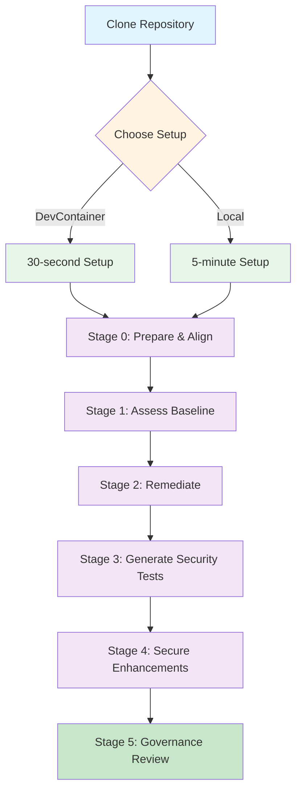

# GitHub Copilot Governance Lab - Java

This repository now hosts an intentionally vulnerable Spring Boot application that mirrors the original Angular governance lab. The goal is unchanged: practice Copilot-assisted remediation while navigating security, documentation, and workflow guardrails. All risky behaviors from the Angular project (open redirects, unsafe storage, unsanitized templates, noisy logging) have been ported to Java on purpose so learners can discover and fix them.

**Prerequisites:**
- Java 17+
- Apache Maven 3.9+
- GitHub Copilot-enabled IDE
- Git

```bash
# Clone the repository
git clone <repository-url>
cd copilot-governance-lab-java

# Run setup script
./scripts/setup-lab.sh

# Or manual setup
mvn validate
```

## Quick Commands
```bash
# Development
mvn spring-boot:run        # Start dev server (http://localhost:8080)
mvn test                   # Run unit tests
mvn verify                 # Tests + Jacoco report

# Quality Checks
./scripts/run-all-checks.sh   # Aggregated Maven checks
./scripts/generate-report.sh  # Produce governance report
```

## Lab Architecture



## Governed Workflow Stages

1. **Stage 0 – Prepare & Align**  
   Review `.github/copilot-instructions.md`, `SECURITY.md`, `LAB_ACTION_GUIDE.md`, and `README.md`. Capture initial assumptions in `docs/workflow-tracker.md`.
2. **Stage 1 – Baseline Assessment**  
   Audit the intentionally vulnerable Java classes under `src/main/java/com/github/copilot/governancelab` (see `docs/vulnerability-guide.md`) and record risks with OWASP mappings, saving your assessment to `docs/plans/stage1-plan.md`.
3. **Stage 2 – Remediation with Copilot**  
   Refactor the vulnerable controllers, services, and templates while following `docs/vulnerability-guide.md` and the tasks captured in `docs/plans/stage2-plan.md`.
4. **Stage 3 – Security Test Generation**  
   Produce comprehensive JUnit coverage using the playbook in `docs/testing-guide.md` and the plan you capture in `docs/plans/stage3-plan.md`.
5. **Stage 4 – Secure Feature Implementation**  
   Implement proactive security features following `docs/secure-features-guide.md` and `docs/plans/stage4-plan.md`.
6. **Stage 5 – Governance Review & Reporting**  
   Execute quality gates, generate `governance-report.md`, and finalize documentation.

See `docs/workflow-guide.md` for detailed tasks per stage.

## Running Analysis Tools

```bash
# Unit tests
mvn test

# Full verification (includes Jacoco report)
mvn verify

# Dependency insights
mvn dependency:tree

# Aggregated governance checks
./scripts/run-all-checks.sh
```

## Project Structure
```
├── src/main/java/com/github/copilot/governancelab/
│   ├── controller/      # MVC & REST controllers (intentionally vulnerable)
│   ├── model/           # Simple DTOs with exposed secrets
│   ├── repository/      # Insecure storage mechanisms
│   └── service/         # Authentication/business logic with risky patterns
├── src/main/resources/
│   ├── templates/       # Thymeleaf views using unsafe rendering
│   └── static/          # Static assets (CSS/JS)
├── docs/                # Governance plans, trackers, coverage logs, guides
├── evaluation/          # Golden evaluation sets
├── static-analysis/     # Analysis tool configs
└── .github/             # GitHub-specific files
```

## Security Checklist
- [ ] Tokens stored server-side securely (currently persisted to disk in plain text)
- [ ] Templates escape untrusted content (`th:text` instead of `th:utext`)
- [ ] Open redirects removed from login flow
- [ ] Uploaded files validated and stored outside web root
- [ ] Debug data hidden from unauthenticated users
- [ ] Session cookies use `HttpOnly`, `Secure`, and `SameSite`
- [ ] CSRF protection enforced on state-changing routes
- [ ] Sensitive logging removed
- [ ] Coverage ≥ 80% on high-risk flows

## Success Metrics
Track these metrics as you implement governance:
- Vulnerabilities detected: ___
- Test coverage achieved: ___%
- Build warnings remaining: ___
- Dependency updates required: ___
- Governance documentation updated (yes/no)

## Common Issues & Solutions

| Issue | Solution |
|-------|----------|
| Copilot not following instructions | Ensure `.github/copilot-instructions.md` is committed |
| Failure to start app | Confirm Java 17 & Maven 3.9 are installed |
| Jacoco report missing | Run `mvn verify` before executing scripts |
| Copilot auto-fixes vulnerabilities | Remind agents to preserve intentionally insecure patterns until the proper lab stage |

## Additional Resources
- [Spring Security Reference](https://docs.spring.io/spring-security/reference/)
- [Spring Boot Documentation](https://docs.spring.io/spring-boot/docs/current/reference/html/)
- [OWASP Java Secure Coding](https://cheatsheetseries.owasp.org/cheatsheets/Java_Security_Cheat_Sheet.html)
- [GitHub Copilot Documentation](https://docs.github.com/copilot)
